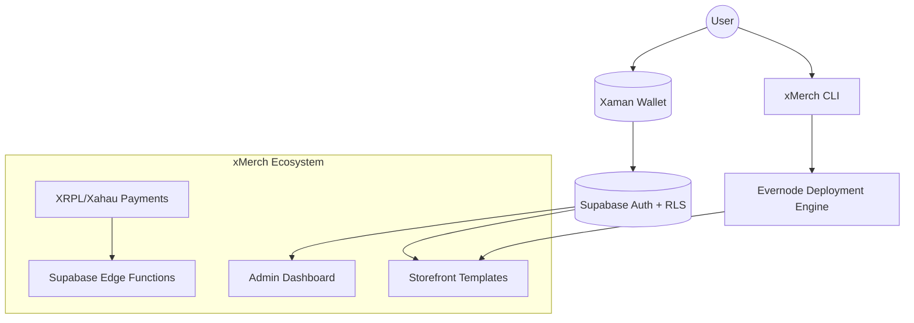
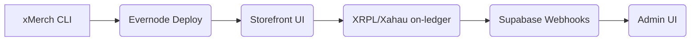
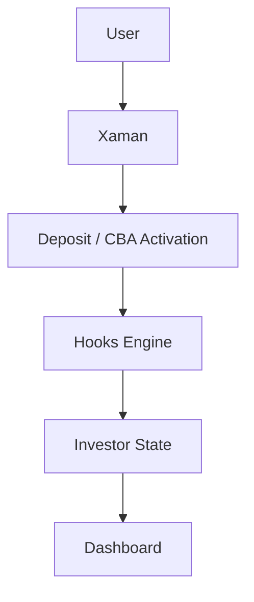
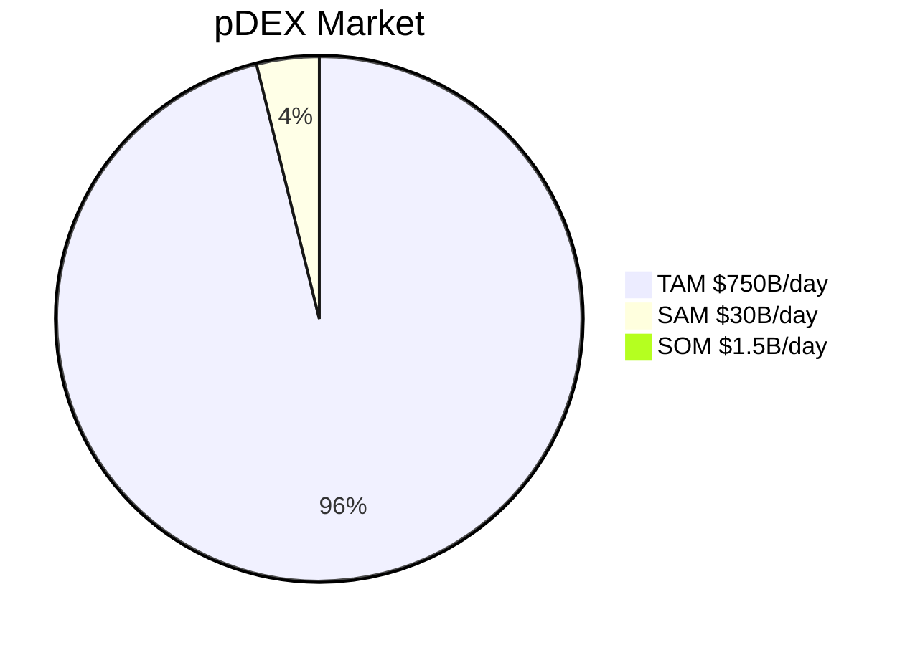

<!-- Top Gradient Banner (Vercel-style) -->
<p align="center">
  
</p>

<h1 align="center">MWorks • Web3 Infrastructure Lab</h1>
<p align="center">Building the AI-powered, Evernode-native, XRPL/Xahau commerce ecosystem for 2026 and beyond.</p>

---

<!-- Stats + npm + contributions -->
<p align="center">

  <!-- xMerch npm -->
  
  
  
  

  <!-- GemWallet -->
  
  

  <!-- GitHub stats -->
  
</p>

---

# 🧩 Architecture Overview

A high-level system diagram showing your entire ecosystem:



> **Fully modular. Fully on-ledger. Fully AI-extendable.**

---

# 🧭 Dynamic Repository Showcase

This section **auto-updates** with your most active repos.

> **Tip:** GitHub automatically updates these cards every few hours.  
> No maintenance required.

<p align="center">

<a href="https://github.com/mworks-proj/xmerch-testing">
  
</a>


<a href="https://github.com/mworks-proj/xmerch-cli">
  
</a>

<a href="https://github.com/mworks-proj/panda-devs">
  
</a>

<a href="https://github.com/mworks-proj/t3-infra">
  
</a>

</p>

---

# 🚀 Meisters (projects)

**Projects below are under dev** or comming soon.

---

<details>
<summary><h2>🛒 xMerch — Web3 Commerce OS</h2></summary>

### Features
- Deploy a full commerce dApp in seconds  
- Evernode-native deployments  
- XRPL/Xahau payments  
- Xaman wallet authentication  
- Printful integration  
- Multi-vendor dashboard  
- Supabase + Edge Functions for security + automation  

### Architecture


### Repos
- https://github.com/mworks-proj/xmerch  
- https://demo.xmerch.app  
- https://xmerch.app  
</details>

---

<details>
<summary><h2>🏗 xBase — XRPL / Xahau Starter Template</h2></summary>

### Includes
- Xaman Auth  
- Supabase RLS + Edge  
- Hooks-ready architecture  
- Evernode deployment pipeline  
- Web3 onboarding flow  

### Repo
https://github.com/mworks-proj/xbase  
</details>

---

<details>
<summary><h2>🏡 PANDA — Real-Estate Fractionalization Engine</h2></summary>

### Features
- Fractional slots  
- Xahau yield via Hooks  
- CBA logic  
- Investor dashboards  
- Supabase state mapping  
- On-chain property lifecycle  

### Architecture Diagram


Repo: https://github.com/mworks-proj/panda-devs  
</details>

---

<details>
<summary><h2>⚡ T3 Infra — Evernode Hosting Platform</h2></summary>

### Features
- Subscription engine  
- Node provisioning  
- Xaman login  
- NFT-based node ownership  
- Evernode deployment pipeline  

Repo: https://github.com/mworks-proj/t3-infra  
</details>

---

<details>
<summary><h2>🧠 Future — Autonomous Product Engine</h2></summary>

### Purpose
A self-expanding, self-optimizing onchain system that:
- Reads markets  
- Generates new digital products  
- Deploys autonomously  
- Evolves logic based on performance  

### Market TAM Diagram


Repo: (private / in-development)  
</details>

---

<details>
<summary><h2> xFlight — Mech Condor Series</h2></summary>

- Animated SVG character  
- Dynamic loadout system  
- Rarity tiers  
- LocalStorage persistence  
- Upcoming NFT integration  

Repo: https://github.com/mworks-proj/xflight  
</details>

---

# 🎨 

<p align="center">
 
</p>

---

# 🧩 Tech Stack

```txt
Next.js 15 • TypeScript • Supabase • Xaman Wallet • XRPL / Xahau • Evernode
LLM Agents • Vercel AI SDK • Tailwind • Docker • Redis
```

---

# 👋 Connect

- **X:** https://x.com/xrpl_mworks  
- **GitHub:** https://github.com/mworks-proj  
- **Website:** https://www.mworks.design  

