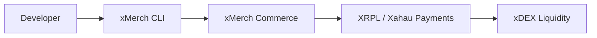

# MWorks • Web3 Commerce Infrastructure
Building the commerce, deployment, and liquidity stack for XRPL / Xahau.

  
  

# 🚦 Start Here

```mermaid
flowchart LR
  Dev[Developer] --> CLI[xMerch CLI]
  CLI --> Commerce[xMerch Commerce]
  Commerce --> Payments[XRPL / Xahau Payments]
  Payments --> xDEX[xDEX Liquidity]
```

Commerce → Deployment → Liquidity

# ⭐ Core Infrastructure

## xMerch
- Multi-vendor storefronts
- Xaman wallet payments
- Evernode-ready deployment
- Supabase Edge automation
- Hook-ready architecture

## xMerch CLI
- Starter templates
- Auth + infra setup
- Fast onboarding
- Deployment pipeline

## xDEX
- IOU issuance flows
- Market maker engine
- Passive liquidity logic
- Edge automation

# 📈 Last 90 Days

- Published xMerch CLI ecosystem tooling
- Built Xaman runtime adapter (xApp + web)
- Released market maker automation for xDEX
- Expanded multi-vendor commerce architecture
- Integrated Evernode deployment pipeline

# 🧩 Tech Stack

Next.js • TypeScript • Supabase • Xaman Wallet  
XRPL / Xahau • Evernode • Tailwind • Redis  
Vercel AI SDK • Edge Functions • Docker

# 👋 Connect

- X: https://x.com/xrpl_mworks
- GitHub: https://github.com/mworks-proj
- Website: https://www.mworks.design
